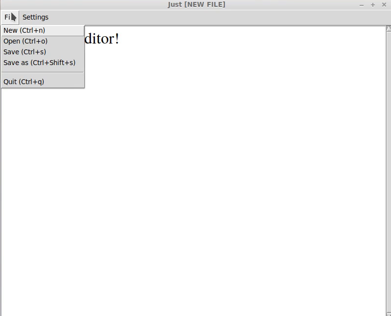

# just
Just is just a text editor, nothing more, nothing less.

## What is Just?

Just is... just a text editor. It's not a Word Processor or an IDE or even a code editor. It's just a text editor, nothing more, nothing less.

## Features

- Cross platform, written in Python with Tkinter
- Save file / Save file as...
- Open file
- Create new file
- Editing works with ctrl+c/x/v
- Fontsize can be adjusted
- Dark and Light modes

## Screenshots

